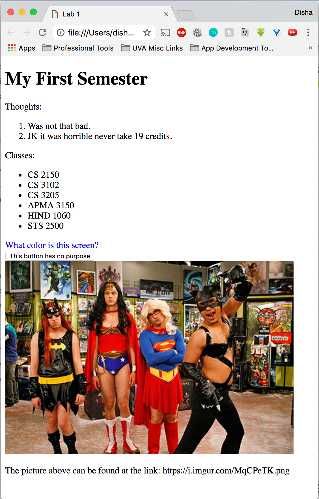

# Homework 1

Due: Thursday, February 1, 2018 by 3:30pm

Estimated Time: 1-1.5 hours

1. **Take Collab HTML lecture quiz. [20%]** This quiz will be graded on accuracy, but you can take the quiz as many times as you want. We really just want you to understand the concepts.

2. **Reconstruct the target_web_page.png in html. [40%]** Find *target_web_page.png* in this subfolder on Github. It should look like this.

   

   Create an .html file and recreate the screenshot with html. The structure of the web page should match as exactly as you can. However, the content of the lists and the image you choose is up to you (be appropriate, of course).

   Note the *title* of the web page. As well, the anchor tag can link to any web page; there's no specific requirement.

   Submit your .html file on Collab.

3. **Write a short paper explaining a failed design. [40%]** We discussed some designs that failed, but could have benefited from a better understanding of the needs and requirements of the user. Now, we want you to find another example. Try to pick something different from what you did in class and write at least two paragraphs about it. We're looking for three things: (1) background as to what happened, (2) how the design failed to consider the user, and (3) how a better understanding of the user would have helped.

   * Looking for around half a page not including sources.
   * Include any sources (links are fine).
   * Single- or 1.15x-spaced.
   * 12pt font.
   * Include your name and computing ID.
   * Submit on Collab.

If you run into any issues, email us Disha Jain (dj9am@virginia.edu) and/or David Zhao (dz6hu@virginia.edu).